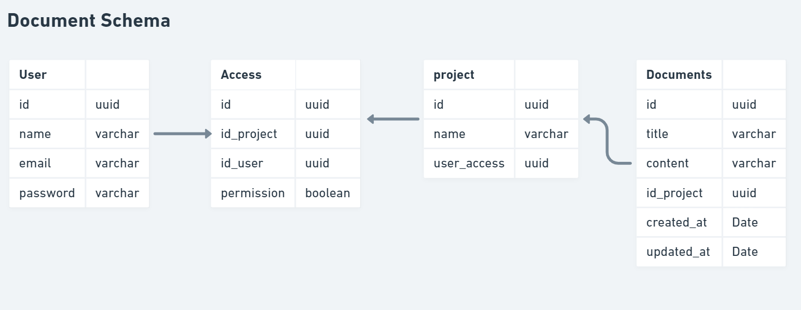

# Gerenciamento de documentos

Projeto desenvolvido em NodeJS com a linguagem Typescript e o framework typeorm com o banco de dados 

## :building_construction: Iniciar
Inicialmente é necessário ter o NodeJs e o Yarn instalado na máquina.

### 1 - Abrir o arquivo database.sqlite abaixo para fazer a conexão do banco de dados.


No meu caso estou utilizando o Beekeepers para conectar ao banco.


### 2 - Rodar as dependências do projeto
No terminal rodar o comando Yarn para trazer todas as dependências

### 3 - Rodar o projeto
Para rodar o projeto é necessário utilizar o seguinte comando:
```` yarn dev ````

## :scroll: Fazer as requisições
Inicialmente é necessário ter o Postman para rodar o link abaixo com as requisições prontas para cada funcionalidade.
<br/>Link: https://documenter.getpostman.com/view/17377506/U16gRT8d 

### Como rodar para cada opção

#### User (Usuário)

- GET - Listar usuário
- POST - Cadastrar usuário a nossa aplicação.
  - Não é possível cadastrar mais de um usuário com o mesmo e-mail.
- POST (Login) - Gerar o token de acesso para os usuário que fizerem o login.
  - Não é possível gerar um token para um usuário inválido.
  - Para poder rodar as próximas rotas é necessário o usuário está autenticado.
  - O token gerado deve ser passado para as próximas rotas na parte de Authorization do postman.
#### Projects
- GET - Listar todos os projetos para usuários autenticados.
- POST - Criar novos projetos para usuários autenticados.
  - Para o corpo da requisição é necessário passar o nome do projeto e o id do usuário (user_access)
  ```` 
  {
    "name": "Projeto 1",
    "user_access": "a6a6ec71-fba9-48cb-b5aa-2de1c6ce554d"
  }
  ````
- DELETE - Remover o projeto pelo id informado na url
  - Só podem excluir o projeto os usuário que criaram o projeto, ou seja, deve passar para o Authorization o token do usuário que criou o projeto.
  ```` 
  http://localhost:3333/projects/d7a93d08-89e5-4212-a118-76773d339770
  ````
- PUT - Alterar projeto pelo id informado na url
  - Só podem alterar o projeto os usuário que criaram o projeto, ou seja, deve passar para o Authorization o token do usuário que criou o projeto.
  - Informar no corpo da requisição o campos abaixo que devem ser alterados.
  ```` 
  {
    "name": "Projeto 2",
  }
  ````
#### Access
- POST - Entidade que relaciona os usuários aos projetos e os torna convidados com direito de escrever ou ler o documento.
  - Só quem pode convidar os usuário é o criador do projeto. 
  - Só irá funcionar se o token do usuário criador do projeto estiver presente no Authorization.
  ```` 
  {
    "permission": false,
    "id_project": "d7a93d08-89e5-4212-a118-76773d339770",
    "id_user": "e0b0270e-e7a6-4844-a131-efa55f22df25"
  }
  ````
#### Documents
- GET - Listar os documentos.
- POST - Criar novo documento por usuários que tem permissão.
  - Passar o token de autenticação de usuários que tem permissão
  - Só irá funcionar se o usuários estiver autenticado
  ````
  {
    "title": "documento 1",
    "content": "documento fala sobre as melhores práticas de programação",
    "id_project": "d7a93d08-89e5-4212-a118-76773d339770"
  }
  ````
- DELETE - Remover documento por usuários que tem permissão, passando o id.
- PUT - Alterar documento por usuários que tem permissão, passando o id.

### Esquema do projeto


